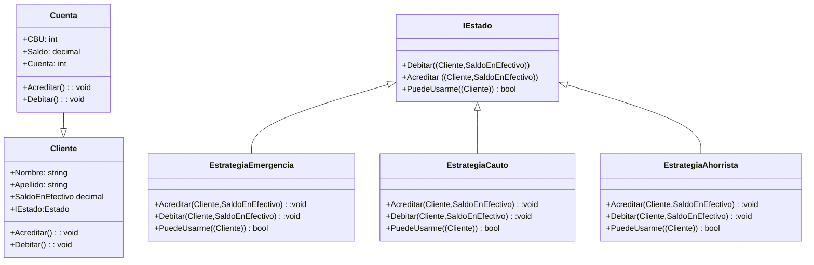

# Diagrama de Banco

```mermaid
classDiagram
    class Cliente {
        +Nombre: string
        +Apellido: string
        +SaldoEnEfectivo decimal
        +Acreditar(): void
        +Debitar(): void
        +IEstado:Estado
    }
    class Cuenta{
        +CBU: int
        +Saldo: decimal
        +Cuenta: int
        +Acreditar(): void
        +Debitar(): void
    }
    class IEstado{
        +Debitar((Cliente,SaldoEnEfectivo))
        +Acreditar ((Cliente,SaldoEnEfectivo))
        +PuedeUsarme((Cliente))bool
    }
    class EstrategiaEmergencia{
        +Acreditar(Cliente,SaldoEnEfectivo):void
        +Debitar(Cliente,SaldoEnEfectivo):void
        +PuedeUsarme((Cliente))bool
    }
    class EstrategiaCauto{
        +Acreditar(Cliente,SaldoEnEfectivo):void
        +Debitar(Cliente,SaldoEnEfectivo):void
        +PuedeUsarme((Cliente))bool
    }
    class EstrategiaAhorrista{
        +Acreditar(Cliente,SaldoEnEfectivo):void
        +Debitar(Cliente,SaldoEnEfectivo):void
        +PuedeUsarme((Cliente))bool
    }
    Cuenta --|> Cliente
    IEstado <|-- EstrategiaEmergencia
    IEstado <|-- EstrategiaCauto
    IEstado <|-- EstrategiaAhorrista

```

