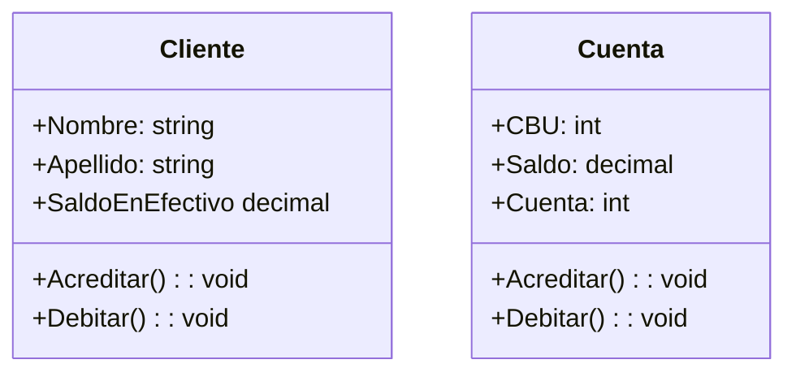

# Diagrama de Banco

```mermaid
classDiagram
    class Cliente {
        +Nombre: string
        +Apellido: string
        +SaldoEnEfectivo decimal
        +Acreditar(): void
        +Debitar(): void
    }
    class Cuenta{
        +CBU: int
        +Saldo: decimal
        +Cuenta: int 
        +Acreditar(): void
        +Debitar(): void
    }
```
